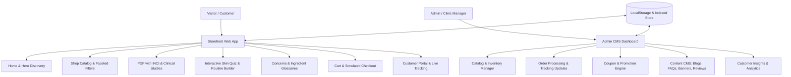

# Implementation Plan: Premium Clinical Skincare E-Commerce Platform & CMS Portal

A medical-grade, luxury skincare e-commerce web platform inspired by science-backed clinical brands (**The Derma Co, Minimalist, Fixderma, SkinCeuticals**), engineered for consumers, dermatologists, cosmetologists, and salon professionals. The platform combines e-commerce sales, interactive skin diagnostics, clinical research presentation, ingredient transparency, customer account management with live order tracking, and an Admin CMS Dashboard with zero external third-party dependencies (100% self-contained).

---

## 1. Architectural Overview & Design System

### Design Philosophy & Aesthetics
- **Visual Identity**: "Clinical Elegance" — clean medical minimalism fused with luxury boutique warmth.
- **Palette**:
  - Medical Pure White & Soft Bone (`#FAFAF8`, `#FFFFFF`)
  - Deep Clinical Slate / Charcoal (`#111827`, `#1F2937`)
  - Signature Medical Emerald & Marine Cerulean (`#0F766E`, `#0284C7`, `#047857`)
  - Subtle Gold / Champagne Accents (`#D97706`, `#B45309`) for premium clinical awards & ratings
- **Typography**: Editorial Serif for prestige headings (*Cormorant Garamond* / *Playfair Display* / *Cinzel*) paired with ultra-clean Sans-Serif (*Plus Jakarta Sans* / *Inter*) for clinical data, ingredients, and metrics.
- **Interactions**: Frosted glass panels (`backdrop-filter: blur`), interactive Before/After sliders, dynamic ingredient percentage counters, smooth drawer transitions, micro-interactions on cart and favorites.



---

## 2. Proposed Scope of Pages & Features

### A. Storefront & Customer Experience
1. **Global Header & Navigation**:
   - Clinical ticker announcement bar (customizable from CMS).
   - Primary navigation: *Shop (by Category & Concern)*, *Skin Diagnostic Quiz*, *Ingredients Lab*, *Clinical Research*, *Concerns Hub*, *About*, *Blog*, *Testimonials*, *FAQ*.
   - Live search modal with instant suggestions & category chips.
   - Quick Currency / Region switcher, Wishlist drawer, Cart drawer with free shipping progress bar, Customer profile menu, Admin Portal quick toggle.
2. **Home Page (`/`)**:
   - High-impact Hero with scientific claims (*"Formulated by 42+ Dermatologists Across 12 Countries"*), clinical trial metrics, and dynamic CTAs.
   - *Shop by Skin Concern* visual carousel (Acne, Hyperpigmentation, Barrier Repair, Aging, Rosacea, Pores).
   - *Best Sellers & Clinical Actives* showcase with quick view, add-to-cart, and active ingredient badges.
   - *Interactive Skin Diagnostic Wizard*: 4-step consultation (Skin type $\to$ Primary concern $\to$ Sensitivity $\to$ Personalized 3-step regimen with 1-click bundle add-to-cart).
   - *Clinical Efficacy & Research Proof* interactive graph section (Melanin reduction, barrier hydration, wrinkle depth improvements).
   - *Ingredient Spotlight* showcasing medical actives (Niacinamide, Retinaldehyde, Salicylic Acid, Multi-Molecular Hyaluronic, Ceramide Complex).
   - *Before & After Interactive Comparison Slider*.
   - *Dermatologist & Advisory Board* credentials showcase.
   - *Lead Gen Newsletter*: instant unlock coupon code.
3. **Product Catalog & Listing (`/shop`)**:
   - Multi-faceted sidebar filtering: By Concern, By Active Ingredient, By Category (Serums, Sunscreens, Cleansers, Moisturizers, Exfoliants, Toners), By Skin Type (Dry, Oily, Sensitive, Combination), By Price range, By Rating.
   - Live keyword search and sorting (Featured, Best Selling, Price Low $\leftrightarrow$ High, Top Rated, Newest).
   - Grid and List views with quick-add variant selector and hover preview.
4. **Product Detail Page (`/product/:id`)**:
   - High-resolution gallery with zoom, texture swatches, and packaging visuals.
   - Active percentage badges (e.g. `10% Niacinamide + 2% Alpha Arbutin`).
   - Size/volume selector (30ml, 50ml, 100ml) with dynamic price calculation.
   - Expandable Clinical Accordions:
     - *Clinical Trial Results & Efficacy Data*
     - *Full INCI Ingredient Transparency Table* (with EWG safety score and purpose)
     - *How to Use & Layering Protocol* (AM vs. PM routine, compatibility warnings)
     - *Dermatologist Prescription / Pro Tip*
   - Interactive Before/After image comparison for the specific product.
   - *Frequently Bought Together* routine bundle discount builder.
   - Customer Reviews with rating filter, verified buyer badges, and submission form.
5. **Skin Concerns Hub (`/concerns` & `/concerns/:slug`)**:
   - Deep-dive medical guides on Acne, Dark Spots, Aging, Damaged Barrier, Sensitive Skin, Open Pores with doctor-curated 3-step AM/PM regimens.
6. **Active Ingredients Lab (`/ingredients` & `/ingredients/:slug`)**:
   - Comprehensive interactive A-Z glossary of skincare actives, molecular weights, synergy pairings, and products containing them.
7. **Clinical Research & Science (`/research`)**:
   - Clinical whitepapers, clinical trial methodology, peer-reviewed findings, dermatologist board member dossiers, safety certificates.
8. **Brand Story & About (`/about`)**:
   - Global doctor collective narrative, ethical formulating standards, laboratory credentials, sustainability & purity commitments.
9. **Blog & Editorial (`/blog` & `/blog/:id`)**:
   - Doctor-authored articles, skin education, category filters, reading time, embedded product purchase widgets.
10. **Testimonials & Real Results (`/testimonials`)**:
    - Filterable patient before/after gallery, video testimonial mockups, dermatologist endorsements.
11. **Help Center & FAQ (`/faq`)**:
    - Searchable FAQs categorized into Orders, Delivery, Product Formulation, Sensitive Skin Usage, Professional Accounts.
12. **Contact & B2B Inquiries (`/contact`)**:
    - General support contact form + Dedicated Wholesale & Dermatologist/Salon Partner inquiry form.
13. **Legal & Compliance Pages (`/privacy`, `/terms`, `/shipping`, `/refunds`)**:
    - Formatted policy documents with table of contents.

### B. E-Commerce Engine & Funnel (Self-Contained)
1. **Interactive Cart Drawer & Dedicated Cart Page (`/cart`)**:
   - Line item quantities, price calculations, item removals.
   - Live promo code engine with validation and instant discount feedback.
   - Tiered Free Shipping & Free Sample threshold progress bar.
2. **Simulated Secure Checkout (`/checkout`)**:
   - Step 1: Customer details & Shipping Address (with saved addresses).
   - Step 2: Shipping method selector (Standard Free vs. Express Clinical Courier).
   - Step 3: Payment simulation (Credit/Debit Card with live card preview, UPI ID / QR code simulation, NetBanking, Cash on Delivery).
   - Complete validation, processing state with spinner, and order number generation.
3. **Order Confirmation & Digital Invoice (`/order-confirmation/:id`)**:
   - Order receipt, itemized billing, printable invoice download, estimated delivery timeline.
4. **Customer Account Portal (`/account`)**:
   - User Profile management & Skin Type preferences.
   - Order History with statuses (Processing, Dispatched, In Transit, Delivered).
   - **Interactive Real-Time Order Tracking** with visual timeline checkpoints, courier details, and simulated live coordinates.
   - Saved Addresses & Wishlist items.

### C. Complete Admin CMS Dashboard (`/admin`)
1. **Analytics Overview**: Real-time sales metrics, revenue, order count, top products, stock alert warnings, monthly sales breakdown.
2. **Product Catalog Manager**:
   - List, search, filter, and paginate products.
   - Add New Product & Edit Product modal/form (Title, SKU, Price, Sale Price, Category, Concerns, Actives, Stock, Sizes, Images, INCI ingredients, How to Use).
   - Delete product & toggle active stock status.
3. **Order Management**:
   - List all customer orders, filter by status (`Pending`, `Processing`, `Shipped`, `Delivered`, `Cancelled`).
   - Change order status in real time (which immediately reflects on the customer's live tracking page).
   - View order details and customer shipping info.
4. **Category & Concern Management**: Add, edit, and organize product categories and skin concern classifications.
5. **Coupon & Discount Engine**:
   - Create and manage coupon codes (Percentage Off, Flat ₹ Off, Min Order Value, Expiry, Active Toggle).
6. **Content CMS**:
   - Manage Blog Articles (Add, Edit, Delete with rich preview).
   - Manage FAQs (Add, Edit, Delete).
   - Manage Testimonials and Reviews.
   - Manage Announcement Bar Ticker & Banner Promotions.
7. **Demo Data Management**: 1-click Reset Demo Data button to restore full seed data at any time.

---

## 3. Technology Stack & Directory Structure

- **Framework**: React 18+ with Vite for instant loading and hot reloading.
- **Routing**: React Router DOM (v6+).
- **Icons**: Lucide React.
- **Styling**: Vanilla Modern CSS / Tailwind CSS for responsive luxury design, glassmorphism, micro-animations.
- **Data Persistence**: Custom reactive Store using `localStorage` with rich preloaded seed datasets (16+ clinical products, reviews, blogs, doctor profiles, coupons, demo orders).

```
Cosmetics/
├── index.html
├── package.json
├── vite.config.js
├── src/
│   ├── main.jsx
│   ├── App.jsx
│   ├── index.css
│   ├── assets/
│   │   └── images/
│   ├── context/
│   │   ├── StoreContext.jsx      # Unified global state (Cart, Wishlist, Auth, Products, Orders, CMS)
│   │   └── ThemeContext.jsx
│   ├── data/
│   │   ├── seedProducts.js       # 16+ clinical grade products with ingredients, clinical trials, usage
│   │   ├── seedConcerns.js       # Skin concerns with doctor regimens
│   │   ├── seedIngredients.js    # Comprehensive active ingredients glossary
│   │   ├── seedBlogs.js          # Dermatologist-written articles
│   │   ├── seedTestimonials.js   # Before/after reviews & clinical endorsements
│   │   ├── seedDoctors.js        # Global advisory board profiles
│   │   └── seedCoupons.js        # Pre-configured promo codes
│   ├── components/
│   │   ├── layout/
│   │   │   ├── Navbar.jsx
│   │   │   ├── AnnouncementBar.jsx
│   │   │   ├── Footer.jsx
│   │   │   ├── CartDrawer.jsx
│   │   │   ├── QuickSearchModal.jsx
│   │   │   └── QuickViewModal.jsx
│   │   ├── common/
│   │   │   ├── ProductCard.jsx
│   │   │   ├── BeforeAfterSlider.jsx
│   │   │   ├── StarRating.jsx
│   │   │   ├── Badge.jsx
│   │   │   └── SectionHeader.jsx
│   │   ├── home/
│   │   │   ├── HeroBanner.jsx
│   │   │   ├── ConcernNavigator.jsx
│   │   │   ├── SkinDiagnosticQuiz.jsx
│   │   │   ├── ClinicalEfficacySection.jsx
│   │   │   ├── IngredientSpotlight.jsx
│   │   │   └── DoctorBoardSection.jsx
│   │   └── admin/
│   │       ├── AdminLayout.jsx
│   │       ├── AdminOverview.jsx
│   │       ├── AdminProducts.jsx
│   │       ├── AdminOrders.jsx
│   │       ├── AdminCoupons.jsx
│   │       ├── AdminContent.jsx
│   │       └── AdminProductModal.jsx
│   └── pages/
│       ├── HomePage.jsx
│       ├── ShopPage.jsx
│       ├── ProductDetailPage.jsx
│       ├── ConcernsPage.jsx
│       ├── ConcernDetailPage.jsx
│       ├── IngredientsPage.jsx
│       ├── ResearchPage.jsx
│       ├── AboutPage.jsx
│       ├── BlogPage.jsx
│       ├── BlogDetailPage.jsx
│       ├── TestimonialsPage.jsx
│       ├── FAQPage.jsx
│       ├── ContactPage.jsx
│       ├── CartPage.jsx
│       ├── CheckoutPage.jsx
│       ├── OrderConfirmationPage.jsx
│       ├── AccountPage.jsx
│       ├── OrderTrackingPage.jsx
│       ├── LegalPage.jsx
│       └── AdminDashboardPage.jsx
```

---

## 4. Verification & Testing Plan

### Automated Verification
- Run `npm run build` to verify clean JSX/JS compilation, asset resolution, and no syntax or type errors.
- Run local dev server `npm run dev` and test responsiveness and zero console errors.

### Manual Feature Flow Verification
1. **Catalog & Filtering**: Filter products by concern (e.g. "Acne"), active ingredient (e.g. "Salicylic Acid"), and sort by price.
2. **Skin Diagnostic Quiz**: Complete the 4-step quiz, verify routine generation, test adding the complete routine bundle to cart with 1 click.
3. **E-Commerce Funnel**: Add items to cart $\to$ open cart drawer $\to$ apply coupon code `DERMA20` $\to$ proceed to checkout $\to$ complete simulated card/UPI payment $\to$ verify order confirmation screen.
4. **Order Tracking**: Open the newly generated order in the Customer Account portal $\to$ view live multi-stage tracking timeline.
5. **Admin CMS Workflow**:
   - Access `/admin` $\to$ view analytics $\to$ add a new clinical product $\to$ verify it immediately appears in `/shop`.
   - Update order status from `Processing` to `Shipped` $\to$ verify customer tracking timeline instantly reflects the change.
   - Create a new coupon code `CLINIC50` $\to$ verify it applies discount in cart.
6. **Mobile Responsiveness**: Test viewport resizing for drawer menus, sticky mobile action bars, and responsive image galleries.

---

## 5. User Review & Feedback

> [!IMPORTANT]
> **Zero External Dependencies Guaranteed**: All features (payment gateway simulation, courier tracking timeline, customer authentication, and CMS operations) are completely built-in and self-contained with persistent local storage. No third-party API keys or paid services are required.

Please review this implementation plan. Once you confirm, we will immediately scaffold the Vite project and build all storefront components, clinical modules, e-commerce workflows, and Admin CMS dashboard!
